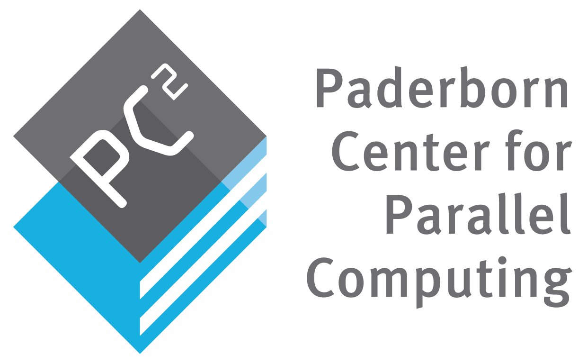

# JuliaUCL24

A four-day Intro to Julia for HPC course that will take place at the [UCL Centre for Advanced Research Computing](https://www.ucl.ac.uk/advanced-research-computing) in London in February 2024.

**Course page:** https://github-pages.arc.ucl.ac.uk/julia-hpc-2024/
 

**Instructor:** [Dr. Carsten Bauer](https://www.carstenbauer.eu)    
**Organizer:** [Dr. Mosè Giordano](https://giordano.github.io/aboutme/)

**PC2 JupyterHub:** https://pc2.de/go/jupyterhub

<!-- 

 
 &nbsp; &nbsp; &nbsp; &nbsp; &nbsp; &nbsp;
 
 &nbsp; &nbsp; &nbsp; &nbsp; &nbsp; &nbsp;
 

 -->

## Tentative schedule

## Acknowledgements

This course is organized by [UCL Centre for Advanced Research Computing](https://www.ucl.ac.uk/advanced-research-computing) and realized in collaboration with the [Paderborn Center for Parallel Computing (PC2)](https://pc2.uni-paderborn.de/), a member of the [German National HPC Alliance (NHR)](https://www.nhr-verein.de/en).

  
  &nbsp; &nbsp; &nbsp; &nbsp; &nbsp; &nbsp;
  
  &nbsp; &nbsp; &nbsp; &nbsp; &nbsp; &nbsp;
  

