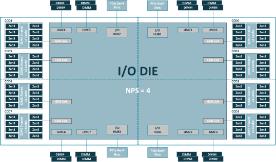

# Exercise: DAXPY on Noctua 2 Node

**Note: For this exercise you will need an entire Noctua 2 compute node.**

In this exercise we want to analyze the performance of a **"DAXPY"** kernel:

```julia
y[i] = a * x[i] + y[i]
```

Here, DAXPY stands for **D**ouble precision (i.e. `Float64`) **A** times **X** **P**lus **Y**.
where `a` is a scalar and `x` and `y` are vectors.

**Initial questions**
* How many floating point operations (FLOPs) happen per DAXPY iteration?
* How many bytes need to be transferred per iteration?
* Is the kernel memory bound (i.e. bounded by data access) or compute bound (i.e. bound by how fast the CPU can crunch numbers)?

<details>
    <summary>Answers</summary>    
    
  * 2 FLOPs, one multiply and one addition.
  * 24 bytes. We read 8 bytes of data twice (`x[i]` and `y[i]`) and write 8 bytes of data once (`y[i]`).
  * The kernel is strongly memory bound.
</details>
<br>

Because the kernel is all about data access, we can use it to
* try to estimate the **maximal memory bandwidth** of a Noctua 2 node
* learn about the effect of **thread pinning** and **NUMA** (non-uniform memory access)

Before we start with the actual exercise tasks, let's give a little bit of background and explore the architecture of a Noctua 2 node.

## Background 1: NUMA in a nutshell

This is the schematic topology of a CPU in Noctua (there are two in each node):



**Image source:** AMD, [High Performance Computing (HPC) Tuning Guide for AMD EPYCTM 7003 Series Processors](https://www.amd.com/system/files/documents/high-performance-computing-tuning-guide-amd-epyc7003-series-processors.pdf)

A set of 16 CPU-cores ("Zen3" in the image) forms a **memory domain** (a quarter in the image, see the dashed lines) in the sense that they share **local memory** (see the "DIMM" bars in the image). The entire CPU has four memory domains (the four quarters in the image). Hence, a Noctua 2 node has 8 memory domains in total.

The crucial point: **Accessing data in a memory domain that is far away from a CPU-core takes much longer than accessing data in the local memory domain.** (That's why it is called NUMA, i.e. non-uniform memory access.)

How can we control where our data (say parts of an array) is located? We can use the so-called **first touch policy**: the core that first writes to an element of the array determines where this element (more specifically the corresponding "memory page") will land, namely in the memory domain that is local to this core. Of course, to actually control this, we need to make sure that our Julia threads run on specific CPU-cores (which then determine the memory location). This thread-core affinity is what we can specify with ThreadPinning.jl (see below).

## Background 2: ThreadPinning.jl (interactive)

**To get an entire Noctua 2 node for interactive usage, you have two choices:**
* Spawn a new Jupyter server (at https://jh.pc2.uni-paderborn.de/hub/home) using the **"JuliaHPC (full CPU node)"** Konfiguration. You can then create a new, empty notebook and do the tasks below.
* Open a terminal in the current Jupyter server and get an interactive session on a node via: `srun -A hpc-lco-usrtr -N 1 --exclusive -p normal -t 00:30:00 --pty bash`. Then navigate to the workshop materials (`cd /scratch/hpc-lco-usrtr/<username>/JuliaUCL24` and start julia with `julia --project`).

1. Use [ThreadPinning.jl](https://carstenbauer.github.io/ThreadPinning.jl/stable/), especially the function `threadinfo()` that it provides, to get a feeling for the architecture of the system.
    * How many cores are available?
    * Is SMT (simultaneous multithreading / "hyperthreading") enabled?
    * How many NUMA domains are there?
    * How many cores constitute a NUMA domain?
(Bonus: You can also use `topology_graphical()` from [Hwloc.jl](https://github.com/JuliaParallel/Hwloc.jl) to get a graphical visualization of the system topology.)

2. Next, make yourself familiar with `pinthreads()`. For example:
    * Start a Julia session with multiple threads (e.g. `-t 10`).
    * Use `threadinfo()` to see which cores / CPU threads the Julia threads are running on. (Note: try the keyword argument `groupby=:numa` which shows you the memory domains of the system.)
    * Check `?pinthreads` to understand which pinning strategies are available and play around with them (always check with `threadinfo()` afterwards)

## Exercise Tasks

1. Look at the given code file `daxpy_cpu.jl` and make yourself familiar with the function `measure_daxpy_perf` (understand what it does).

2. Implement the `axpy_kernel_dynamic!` and `axpy_kernel_static!` functions (look for the first two TODO annotations).

3. Implement the TODOs in the function `generate_input_data`. Depending on the value of the keyword argument `parallel`, this function will fill the input vectors for the (D)AXPY operation with random numbers either sequentially or in parallel. (**Note:** This might seem irrelevant but very much isn't be because of the **first-touch policy** mentioned above.)

4. Submit the given job script via `sbatch daxpy_cpu_job.sh`. (You need to open a terminal here in Jupyter, navigate to the correct subfolder under `/scratch/hpc-lco-usrtr/<username>` and then run the `sbatch` command.) This will run the file `daxpy_cpu.jl` with 8 Julia threads. The job might take a few minutes to start/run.

The job should produce an output file (has extension `.out`). It should show two tables like below, one for the `:static` and one for the `:dynamic` multithreading variant.

```
Memory Bandwidth (GB/s)
┌───────────────┬─────────┬───────────┐
│ # Threads = X │ :serial │ :parallel │
├───────────────┼─────────┼───────────┤
│        :cores │   00.00 │     00.00 │
│      :sockets │   00.00 │     00.00 │
│         :numa │   00.00 │     00.00 │
└───────────────┴─────────┴───────────┘
```

The columns (`:serial`, `:parallel`) indicate how the data was initialized. The rows (`:cores`, `:sockets`, `:numa`) indicate how the Julia threads have been pinned to CPU-cores (i.e. just to the first 8 cores or in a round-robin fashion to different sockets or memory domains, respectively).

5. Inspect the output file and focus on the `:static` case first. Can you make sense of the results? What do you learn from this?
    1. **Hint 1:** Why is the pinning irrelevant in the `:serial:` case?
    2. **Hint 2:** Take (approximate) ratios of the numbers (e.g. "`:parallel / :serial`" for different pinning strategies).
    3. **Hint 3:** How many sockets does a Noctua 2 node have? How many memory domains are there in total? 😉

* **"Answers":**
  * We see that pinning threads in combination with parallel initialization is absolutely crucial for performance!
  * The thread pinning is irrelevant in the `:serial` case because the entire data lies in the first memory domain (because it has been written by the "main" Julia thread that is pinned to the first CPU-core of the system). Consequently the performance is limited by the corresponding memory channel when multiple threads try to read and write the data in parallel.
  * Essentially, we find the relative factors 1 (for `:cores`), 2 (for `:sockets`) and 8 (for `:numa`). This makes quite a lot of sense since with 8 threads we are precisely using this many memory domains / channels with each pinning strategy. We (approximately) observe perfect speedup that scales with the number of memory domains / channels used.

7. **Bonus:** Let's perform a scaling analysis and, among others, run a performance measurement with 128 threads (one thread per core). This will give us a (crude) empirical estimate for the maximal memory bandwidth of a Noctua 2 compute node. We've already prepared the Julia script `scaling_daxpy_cpu.jl` to this end that produces tabular output as well as a scaling plot. Run the scaling analysis via `sbatch scaling_saxpy_cpu_job.sh` and (after ~15 minutes) inspect the results.