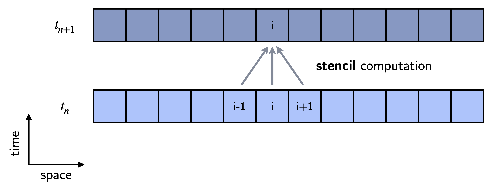
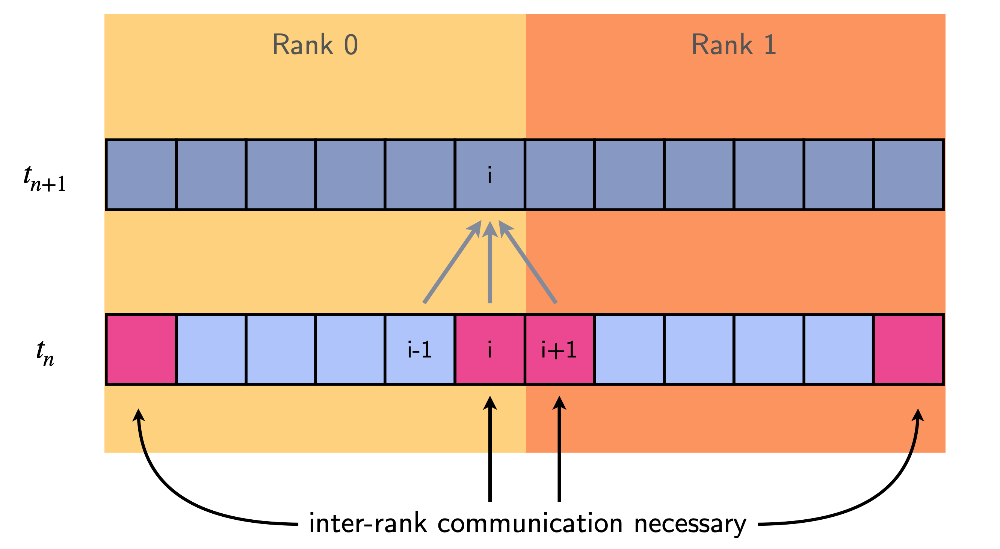

# Exercise: Diffusion (1D) with MPI

[**Diffusion** equation](https://en.wikipedia.org/wiki/Diffusion_equation):
$$ \dfrac{\partial f(x, t)}{\partial t} = D \Delta f(x,t) $$

This equation describes the diffusion of a density $f$ over time (e.g. the diffusion of heat in a material). $D$ is a diffusion constant and $\Delta$ is the [Laplace operator](https://en.wikipedia.org/wiki/Laplace_operator), indicating second-order spatial derivatives. To solve this equation, that is to determine the time evolution of $f(x,t)$ from a given initial condition, we discretize both space and time.

Discretisation in **space** ([finite difference](https://en.wikipedia.org/wiki/Finite_difference)):

$$\dfrac{\partial f(x_i)}{\partial t} = D \Delta f(x_i) \approx \dfrac{D}{h^2} \left[ f(x_{i-1}) - 2f(x_i) + f(x_{i+1}) \right]$$

Discretisation in **time** ([Euler method](https://en.wikipedia.org/wiki/Euler_method)):

$$f(x_i, t_{n+1}) \approx f(x_i, t_n) +  \dfrac{D \Delta t}{h^2} \left[ f(x_{i-1}) - 2f(x_i) + f(x_{i+1}) \right]$$

This formula is a practical prescription of how to move $f(x_i,t_n)$ forward in time ($t_n \rightarrow t_{n+1}$) at every point $x_i$. It has the character of a [**stencil**](https://en.wikipedia.org/wiki/Iterative_Stencil_Loops): the new value of $f$ at the position $x_i$ depends on the local neighborhood, namely $f(x_{i-1})$, $f(x_i)$, and $f(x_{i+1})$.

    

In this exercise we want to solve the diffusion equation in parallel using MPI. To this end, we divide the one-dimensional spatial grid into equal parts and assign each part to a MPI rank (see figure below for case of two MPI ranks). For simplicity, we consider periodic boundary conditions.

Because of the stencil character there is **inter-rank communication** necessary at the boundaries: an MPI rank needs information from the neighboring ranks.

    

In practice, each rank will locally only hold the (regular) cells of the global grid that it is responsible for plus two **ghost cells** at the boundaries (see figure below). The latter are needed for the update procedure but won't be updated by the rank. Instead, in each time step iteration it will exchange (i.e. **communicate**) the new value of these ghost cells with neighboring ranks.

    

## Tasks

1. Look at the file `diffusion_1d.jl`. It contains an implementation of the MPI-parallel solver for the diffusion equation described above for an random initial state. Blocking point-to-point communication is used to transfer the ghost cell information to the neighboring ranks in each time step.
    1. Try to understand the general structure of the program.
    2. Can the program run into a deadlock? Why not?

We want to improve the parallel solver by using **non-blocking communication**. This allows us to
* get rid of the `if iseven(rank)` branching (manual deadlock avoidance)
* overlap the communication with (parts of) the stencil computation 

2. Take a closer look at the actual stencil computation in `diffusion_1d.jl` (marked by the comment `# stencil computation`).
    1. Which part of the loop is dependent on ghost cell information and thus needs to wait for inter-rank communication to actually complete?
    2. Which part is independent of ghost cells and can thus be computed irrespective of any communication?

3. Based on what you've learned in tasks 1. and 2. open the skeleton file `diffusion_1d_hidecomm.jl` and use non-blocking communication primitives to **overlap the communication with the stencil computation** (the part that is independent of the communication). Specifically, implement the sections indicated by `# TODO` and `????`.
    1. **Important note:** (Re-)use the preallocated `MPI.Request`s in the variable `reqs` for the non-blocking commands, e.g. `MPI.Isend(some_data, comm, reqs[1]; dest=whoever)`.

4. Compare your implementation both in terms of correctness and speed to the implementation in `diffusion_1d.jl` by executing the script `noctua2_job.sh` locally (i.e. `sh noctua2_job.sh`).
    1. Do the printed checksums match? Otherwise there is a mistake in your code.
    2. Is your non-blocking variant faster than the blocking one in `diffusion_1d.jl`? By how much?
    
5. We expected a larger performance difference when running the MPI ranks on different nodes (Why?). Submit the script `noctua2_job.sh` to SLURM via `sbatch noctua2_job.sh`. This will run 10 MPI ranks on two nodes (5 ranks per node). The output, once available, will be written to a file `mpi_diffusion_job-*.out`. How much faster is the optimized variant this time?
    
**Note:** In the considered codes, we fix the number of cells per rank. Hence, increasing the number of MPI ranks doesn't improve performance. Instead, the problem that you solve in this case is just bigger! ("weak scaling")